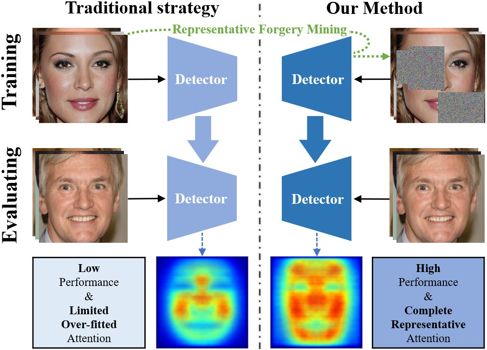

# Representative Forgery Mining for Fake Face Detection

This repository contains the Pytorch implementation of Representative Forgery Mining for Fake Face Detection. If you find our code useful in your research, please cite:

```
@inproceedings{wangCVPR21rfm,
  author    = {Wang, Chengrui and Deng, Weihong},
  title     = {Representative Forgery Mining for Fake Face Detection},
  booktitle = {IEEE Conference on Computer Vision and Pattern Recognition (CVPR)},
  year      = {2021}
}
```

## Overview



## Setup

This repository is build upon Python v3.8 and Pytorch v1.7.0 on Ubuntu 18.04. 

You have to request datasets from:

1. [FaceForensics ++ : Learning to Detect Manipulated Facial Images](https://github.com/ondyari/FaceForensics)

2. [On the Detection of Digital Face Manipulation](http://cvlab.cse.msu.edu/project-ffd.html)
3. [Celeb-DF: A Large-scale Challenging Dataset for DeepFake Forensics](https://github.com/yuezunli/celeb-deepfakeforensics)

and extra model from:

1. [What makes fake images detectable? Understanding properties that generalize](https://chail.github.io/patch-forensics/)

### For training:

The default baseline model is xception. If the datasets mentioned above are ready to use, run:

```
python train.py
```

### For visualization:

Average FAM can be generated for representative forgery visualization, run:

```
python AvgFAM.py
```

### Contact:

If you have any questions about our work, feel free to contact us through email (Chengrui Wang: crwang@bupt.edu.cn).
